# Intelligent Irrigation System
Details in this [Report](Technical_Report.pdf) 
## Members
- Weiwei(2740470W)
- Jinhai Hu(2822462H)
- Li Meiwen(2429437L)
- Qian Xiaoyu(2824018Q)

# Irrigation System
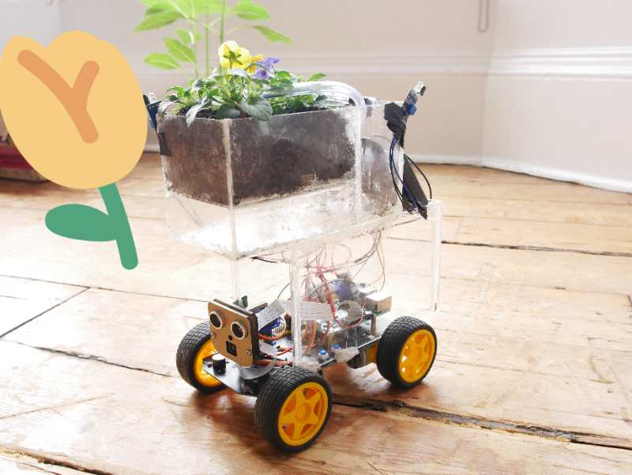
The Irrigation System is designed to automatically water plants based on their needs. It uses sensors to monitor soil moisture levels and adjusts the watering schedule accordingly.
## Social Medium
<!-- Needed to display sideways -->

<!-- display the social media buttons in your README -->

## Hardware Components

- Soil moisture sensor: Measures the moisture content in the soil.
- Water pump: Delivers water to the plants when needed.
- Microcontroller: Collects data from sensors and controls the water pump.

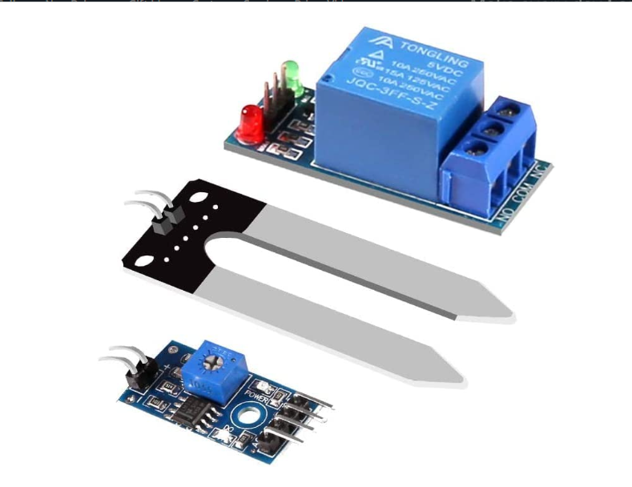

# Intelligent Car System

The Intelligent Car System is responsible for the mobility of the overall system. It allows the irrigation system to move around and cover a larger area.

## Hardware Components

- Motors: Provide motion to the car.
- Wheels: Enable the car to move.
- Battery: Supplies power to the motors and other electronic components.

# Overall System Assembly

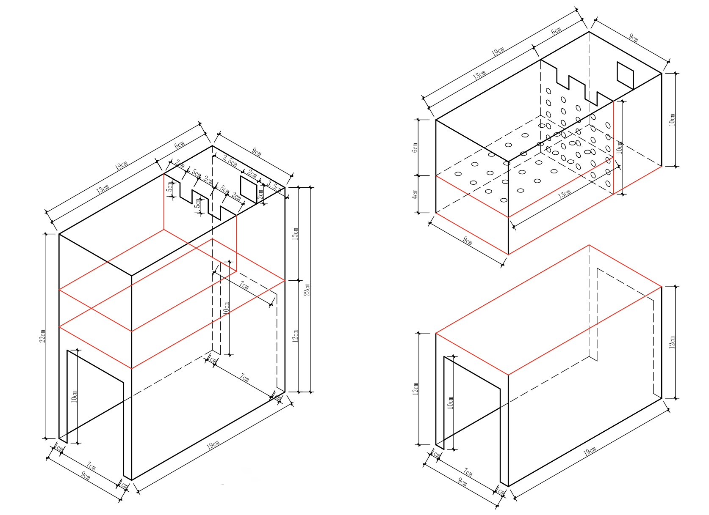
The Overall System Assembly combines the Irrigation System and the Intelligent Car System to create a mobile, automated solution for watering plants.

## System

- Irrigation System: Takes care of watering the plants.
- Intelligent Car System: Provides mobility to the irrigation system.

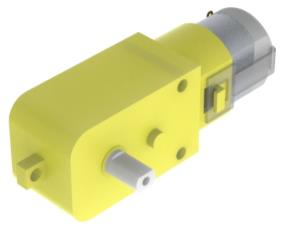
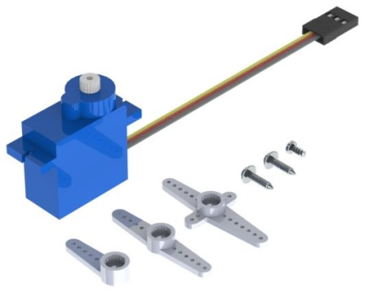
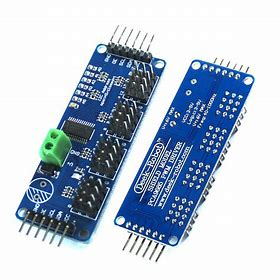

# Soft Design and Function

The software part of the system ensures seamless integration between the irrigation system and the intelligent car system.

## 1) Path Planning
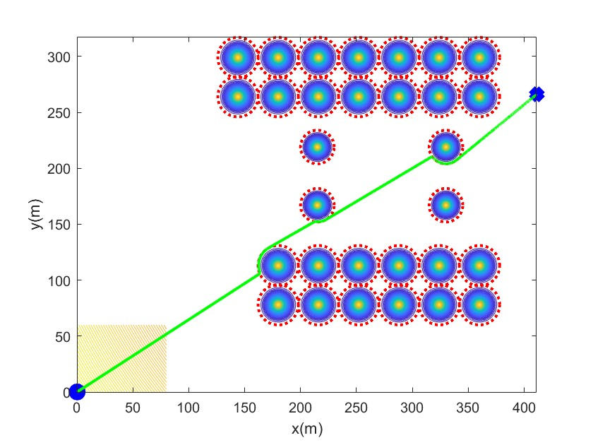
The system uses path planning algorithms to navigate efficiently and avoid obstacles while moving from one plant to another.

## 2) Infrared Sensor Activation
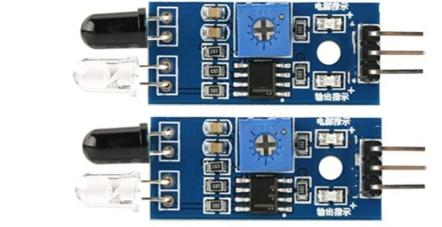
Infrared sensors detect obstacles and help the system navigate safely.

## 3) Light-sensitive Sensor
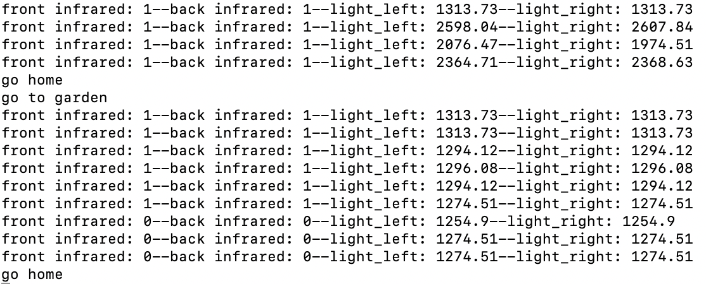
The light-sensitive sensor measures the ambient light, ensuring optimal lighting conditions for plant growth.

## 4) Irrigation System
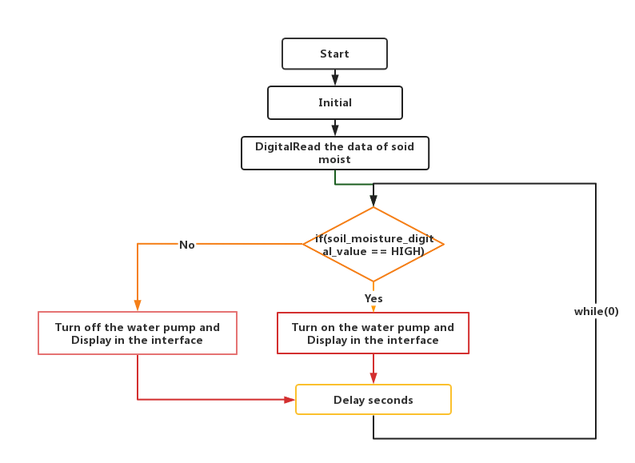
The software component of the irrigation system receives data from the soil moisture sensors and controls the water pump accordingly.

# The process of flower growing

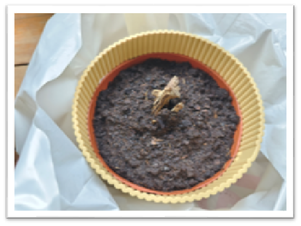
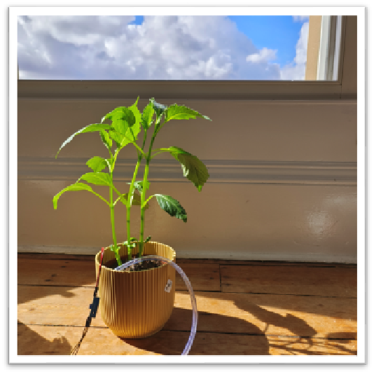

# compile commands
g++ -o testMotor testMotor.cpp pca9685/pca9685.c -lwiringPi -pthread ./testMotor 2000 1/0
g++ -o pre_guidance pre_guidance.cpp pca9685/pca9685.c -lwiringPi -pthread
g++ -o 
# key word
Raspberry C++ PCA9685
